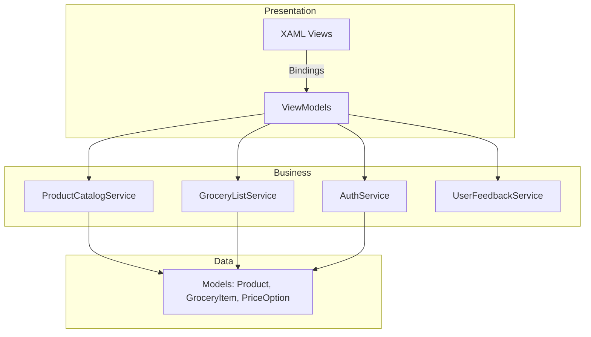
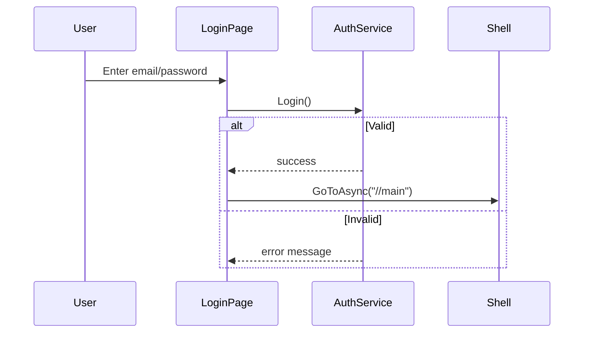
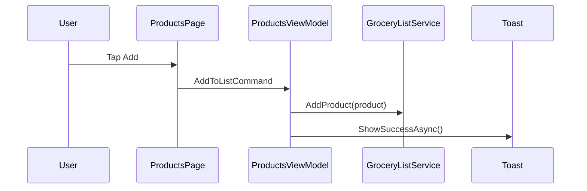

# GroceryMate — Technical Documentation

**Version:** 1.0  
**Application ID:** `com.companyname.grocerymate`  
**Platform:** .NET MAUI (multi-platform)  
**Target frameworks:** `net10.0-android`, `net10.0-ios`, `net10.0-maccatalyst`, `net10.0-windows10.0.19041.0`

---

## 1. Executive Summary

**GroceryMate** is a cross-platform mobile and desktop grocery shopping companion built with **.NET MAUI**. It helps users browse a product catalog, build a personal grocery list, compare prices across stores, and manage their own product entries—all within a single native UI that runs on Android, iOS, Mac Catalyst, and Windows.

The app uses the **Model–View–ViewModel (MVVM)** pattern with **dependency injection**, **Shell-based navigation**, and **in-memory services** for demonstration and coursework purposes. There is no remote API; data lives in memory for the session and resets when the app restarts (except user accounts registered during the session).

### Key capabilities

| Feature | Description |
|--------|-------------|
| Authentication | Login and sign-up with local validation |
| Product catalog | Searchable list of seeded and user-added products |
| Product detail | View description, price, and add to list |
| Grocery list | Track items, quantities, check-offs, and estimated total |
| Price compare | Simulated multi-store pricing with “best price” highlight |
| Add product | Form to create new catalog entries |
| User feedback | Success toasts via Community Toolkit |

---

## 2. Technology Stack

| Layer | Technology | Version / notes |
|-------|------------|-----------------|
| Runtime | .NET | 10.0 |
| UI framework | .NET MAUI | 10.0.41 |
| Language | C# | 12+ (nullable enabled) |
| UI markup | XAML | Compiled bindings (`x:DataType`) |
| Toolkit | CommunityToolkit.Maui | 14.1.0 (animations, toasts) |
| DI | Microsoft.Extensions.DependencyInjection | Built into MAUI host |
| Logging | Microsoft.Extensions.Logging.Debug | 10.0.0 (Debug builds) |
| Navigation | Shell | Routes, tabs, query parameters |

### Development requirements

- **.NET 10 SDK**
- **MAUI workload:** `dotnet workload install maui`
- **Android:** Android SDK + emulator or device (API 21+)
- **iOS / Mac Catalyst (macOS):** Xcode
- **Windows:** Windows 10 SDK (10.0.17763+)

---

## 3. Architecture Overview

GroceryMate follows a layered MVVM architecture. Views bind to ViewModels; ViewModels orchestrate user actions and call Services; Services own business logic and in-memory data. Models are plain data types shared across layers.



### Design principles

- **Separation of concerns:** UI logic in ViewModels, persistence rules in Services.
- **Single source of truth:** `ProductCatalogService.Products` and `GroceryListService.Items` are shared `ObservableCollection` instances injected as singletons.
- **Reactive UI:** `INotifyPropertyChanged` on ViewModels and `GroceryItem`; collection change events drive list totals and filters.
- **Shell navigation:** Global routes for auth; tab bar for main app; registered routes for modal/stack pages.

---

## 4. Project Structure

```
GroceryMate/
├── App.xaml / App.xaml.cs          # Application entry, global resources
├── AppShell.xaml / .cs             # Shell navigation, route registration
├── MauiProgram.cs                  # DI container, MAUI builder
├── GroceryMate.csproj              # Multi-target project file
├── MOBDEV FP.sln                   # Solution file
│
├── Models/
│   ├── Product.cs
│   ├── GroceryItem.cs
│   └── PriceOption.cs
│
├── Services/
│   ├── AuthService.cs
│   ├── ProductCatalogService.cs
│   ├── GroceryListService.cs
│   └── UserFeedbackService.cs
│
├── ViewModels/
│   ├── BaseViewModel.cs
│   ├── LoginViewModel.cs
│   ├── SignupViewModel.cs
│   ├── ProductsViewModel.cs
│   ├── ProductDetailViewModel.cs
│   ├── AddProductViewModel.cs
│   ├── GroceryListViewModel.cs
│   └── PriceCompareViewModel.cs
│
├── Views/
│   ├── LoginPage.xaml
│   ├── SignupPage.xaml
│   ├── ProductsPage.xaml
│   ├── ProductDetailPage.xaml
│   ├── AddProductPage.xaml
│   ├── GroceryListPage.xaml
│   └── PriceComparePage.xaml
│
├── Resources/
│   ├── Styles/Colors.xaml          # Brand palette, gradients
│   ├── Styles/Styles.xaml          # Reusable control styles
│   ├── Fonts/                      # Open Sans
│   ├── Images/, AppIcon/, Splash/
│
└── Platforms/                      # Android, iOS, Mac Catalyst, Windows
```

---

## 5. Data Models

### 5.1 `Product`

Represents an item in the store catalog.

| Property | Type | Description |
|----------|------|-------------|
| `Id` | `string` | GUID (auto-generated) |
| `Name` | `string` | Display name |
| `Category` | `string` | e.g. Produce, Dairy, Pantry |
| `Price` | `decimal` | Base price at primary store |
| `Store` | `string` | Primary store name |
| `Unit` | `string` | e.g. "per lb", "1L" |
| `Description` | `string` | Product details |
| `Aisle` | `string` | Location hint |

### 5.2 `GroceryItem`

A line item on the user’s grocery list.

| Property | Type | Description |
|----------|------|-------------|
| `Product` | `Product` | Reference to catalog product |
| `Quantity` | `int` | Count (default 1) |
| `IsChecked` | `bool` | Checked-off state |
| `Total` | `decimal` | Computed: `Quantity × Product.Price` |

Implements `INotifyPropertyChanged` for live UI updates.

### 5.3 `PriceOption`

Simulated price at an alternate store for comparison.

| Property | Type | Description |
|----------|------|-------------|
| `Store` | `string` | Store name |
| `Price` | `decimal` | Adjusted price |
| `Note` | `string` | e.g. "Weekly deal" |
| `IsBest` | `bool` | Lowest price flag |

---

## 6. Services Layer

### 6.1 `AuthService` (Singleton)

In-memory user store for demo authentication.

- **Login:** Validates email/password against dictionary (case-insensitive email).
- **SignUp:** Enforces required fields, minimum password length (6), password match, and unique email.
- **Seed user:** `demo@grocerymate.com` / `password123`

> **Note:** Not suitable for production—no hashing, no persistence, no network security.

### 6.2 `ProductCatalogService` (Singleton)

Owns the product catalog and price-comparison data.

- **`Products`:** `ObservableCollection<Product>` with 9 seeded items.
- **`Categories` / `Stores`:** Fixed lists for pickers on Add Product.
- **`AddProduct`:** Inserts at top, generates price options.
- **`GetById`:** Lookup for detail and compare screens.
- **`GetPriceOptions`:** Returns four store variants per product; marks lowest price as `IsBest`. Prices are derived from base price using fixed multipliers (e.g. MarketHub × 0.92).

### 6.3 `GroceryListService` (Singleton)

Manages the session grocery list.

| Method | Behavior |
|--------|----------|
| `AddProduct` | Increments quantity if product already on list; otherwise adds new `GroceryItem` |
| `Remove` | Removes item from collection |
| `Toggle` | Flips `IsChecked` |
| `Increase` / `Decrease` | Adjust quantity (minimum 1) |

### 6.4 `UserFeedbackService` (Static)

Displays success toasts using **CommunityToolkit.Maui** `Toast`:

- Add to grocery list: `"{name} added to your grocery list."`
- Save new product: `"{name} added to the catalog."`

---

## 7. ViewModels & Views

| Screen | ViewModel | Primary responsibilities |
|--------|-----------|---------------------------|
| Login | `LoginViewModel` | Email/password login, navigate to sign-up |
| Sign up | `SignupViewModel` | Registration, validation messages |
| Products | `ProductsViewModel` | Search filter, view detail, add to list, navigate to add product |
| Product detail | `ProductDetailViewModel` | Load product by ID, add to list, go to compare |
| Add product | `AddProductViewModel` | Form validation, save to catalog, toast, go back |
| Grocery list | `GroceryListViewModel` | Display items, total cost, remove |
| Price compare | `PriceCompareViewModel` | Product picker, store price list |

All ViewModels inherit **`BaseViewModel`**, which provides `SetProperty` and `INotifyPropertyChanged`.

Pages resolve ViewModels via **`App.Services.GetRequiredService<T>()`** (service locator pattern on top of DI registration in `MauiProgram`).

---

## 8. Navigation & Routing

### 8.1 Shell structure

```
/login          → LoginPage
/signup         → SignupPage
//main          → TabBar
    ├── Products        → ProductsPage
    ├── Grocery List    → GroceryListPage
    └── Compare         → PriceComparePage
```

On startup, `AppShell` dispatches navigation to `//login`.

### 8.2 Registered routes (`AppShell.xaml.cs`)

| Route | Page | Query params |
|-------|------|----------------|
| `add-product` | `AddProductPage` | — |
| `product-detail` | `ProductDetailPage` | `id` (product GUID) |
| `price-compare` | `PriceComparePage` | `id` (optional, pre-selects product) |

### 8.3 Example navigation calls

```csharp
await Shell.Current.GoToAsync("//main");                              // After login
await Shell.Current.GoToAsync("add-product");                       // Add product
await Shell.Current.GoToAsync($"product-detail?id={product.Id}");   // Detail
await Shell.Current.GoToAsync($"price-compare?id={product.Id}");      // Compare
await Shell.Current.GoToAsync("..");                                  // Back
```

Detail and compare pages use **`[QueryProperty]`** to receive the `id` parameter.

---

## 9. Dependency Injection

Configured in `MauiProgram.CreateMauiApp()`:

| Lifetime | Type |
|----------|------|
| Singleton | `AppShell`, `AuthService`, `ProductCatalogService`, `GroceryListService` |
| Transient | All ViewModels and Views |

```csharp
builder.Services.AddSingleton<Services.AuthService>();
builder.Services.AddSingleton<Services.ProductCatalogService>();
builder.Services.AddSingleton<Services.GroceryListService>();
builder.Services.AddTransient<ViewModels.ProductsViewModel>();
// ... etc.
```

`App.Services` exposes the root `IServiceProvider` after build for page-level ViewModel resolution.

---

## 10. User Interface & Design System

### 10.1 Visual identity

- **Primary green:** `#0B5D3A` — buttons, accents, checkboxes  
- **Background cream:** `#F6EFE5` — page backgrounds  
- **Typography:** Open Sans Regular / Semibold  
- **Cards:** Rounded borders, soft gradients (`HeroGradient`, `CardGradient`)

### 10.2 Shared styles (`Resources/Styles/Styles.xaml`)

| Style key | Usage |
|-----------|--------|
| `DisplayTitle`, `HeroTitle`, `SectionTitle` | Headings |
| `HeroCard`, `SurfaceCard`, `InputCard`, `ProductCard` | Containers |
| `PrimaryButton`, `GhostButton`, `QuietPillButton` | Actions |
| `ChipLabel`, `TagLabel`, `PriceLabel` | Metadata |
| `FormLabel`, `BodyText`, `CaptionLabel` | Form and body copy |
| `InputEntry`, `InputEditor` | Text inputs |

### 10.3 Animations

Pages use **CommunityToolkit.Maui** `AnimationBehavior` with `FadeAnimation` on load for subtle entrance effects.

---

## 11. User Flows

### 11.1 Authentication flow



### 11.2 Add to grocery list



### 11.3 Add new catalog product

1. User taps **Add product** on Products tab.  
2. `AddProductPage` — fill name, description, category, store, price, unit.  
3. Validation runs in `AddProductViewModel.SaveAsync`.  
4. Product inserted into catalog; toast shown; navigate back.  
5. Products list refreshes via `CollectionChanged` on catalog.

---

## 12. Build & Run

Always specify the project file when multiple `.sln` / `.csproj` files exist in the folder.

```bash
# Restore
dotnet restore GroceryMate.csproj

# Build
dotnet build GroceryMate.csproj

# Run (pick one target)
dotnet build GroceryMate.csproj -t:Run -f net10.0-android
dotnet build GroceryMate.csproj -t:Run -f net10.0-maccatalyst
dotnet build GroceryMate.csproj -t:Run -f net10.0-ios
dotnet build GroceryMate.csproj -t:Run -f net10.0-windows10.0.19041.0
```

### Android emulator tips

- Confirm device is online: `adb devices` → status `device`
- Package ID: `com.companyname.grocerymate`
- Force reinstall if needed: `adb uninstall com.companyname.grocerymate`

---

## 13. Demo Credentials

| Field | Value |
|-------|--------|
| Email | `demo@grocerymate.com` |
| Password | `password123` |

New accounts created via Sign Up persist for the app session only.

---

## 14. Seeded Catalog (Sample Data)

The app ships with 9 products across categories: Produce, Dairy, Bakery, Meat, Pantry, Snacks, and Beverages, sourced from stores FreshMart, GreenBasket, MarketHub, and DailyHarvest.

Price comparison generates four options per product with algorithmic adjustments and highlights the lowest price.

---

## 15. Known Limitations & Future Work

| Area | Current state | Possible enhancement |
|------|---------------|------------------------|
| Persistence | In-memory only | SQLite, Preferences, or REST API |
| Authentication | Plain-text passwords in memory | Secure storage, OAuth, ASP.NET backend |
| Images | No product photos | `ImageUrl` + MAUI `Image` controls |
| Grocery list | Remove only; no +/- in UI | Wire `Increase`/`Decrease` commands in XAML |
| Offline sync | N/A | Cloud sync, shared household lists |
| Unit tests | None | ViewModel and service unit tests |
| CI/CD | Manual build | GitHub Actions for Android/iOS |

---

## 16. Package Dependencies

```xml
<PackageReference Include="CommunityToolkit.Maui" Version="14.1.0" />
<PackageReference Include="Microsoft.Maui.Controls" Version="10.0.41" />
<PackageReference Include="Microsoft.Extensions.Logging.Debug" Version="10.0.0" />
```

---

## 17. Presentation Talking Points

1. **Cross-platform from one codebase** — Single C#/XAML project targets four platforms via .NET MAUI.  
2. **Industry-standard MVVM** — Clear separation enables testing and team parallel work.  
3. **Modern UX** — Custom design system, animations, and toast feedback.  
4. **Composable navigation** — Shell tabs + stack routes scale to larger apps.  
5. **Extensible services** — Swapping in-memory services for APIs requires minimal ViewModel changes.  
6. **Course-ready demo** — Auth, CRUD-like catalog add, list management, and comparison in one cohesive app.

---

## 18. Document History

| Date | Change |
|------|--------|
| 2026-05-16 | Initial technical documentation for GroceryMate v1.0 (.NET 10 / MAUI 10) |

---

*GroceryMate — Technical Documentation — For academic and presentation use.*
